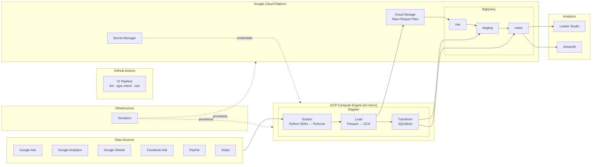

## Overview

The data platform runs on Google Cloud Platform and powers all organizational data apps and services.

## Components

### Data Sources

The pipeline ingests data from six sources:

- Google Ads
- Google Analytics
- Google Sheets
- Facebook Ads
- PayPal
- Stripe

### Extract

Custom [Extractor](../api/extractor.md) modules pull data through each source's Python SDK or API and return standardized PyArrow tables. A shared `to_table()` function converts Pydantic models to Arrow, so each extractor only defines its schema and fetch logic.

### Load

Custom [Loader](../api/loader.md) modules write extracted tables to Google Cloud Storage as Parquet files, partitioned by source and date. GCS serves as both the landing zone and the data lake.

### Data Warehouse

BigQuery serves as the data warehouse. Tables are organized into three datasets: `raw`, `staging`, and `marts`.

### Transform

SQLMesh runs transformations inside BigQuery. Staging models clean and type-cast raw data. Mart models answer business questions around enrollment, inventory, ad attribution, and revenue.

### Analytics

Users access insights through Looker Studio and Streamlit.

### Orchestration

Dagster orchestrates the pipeline on a daily schedule. It runs on a GCP `e2-micro` VM as two systemd services under a dedicated `dagster` user:

- **dagster-code** — a gRPC code server (`127.0.0.1:4266`) that loads asset definitions.
- **dagster** — the daemon that schedules and executes runs. Depends on `dagster-code`.

A systemd timer runs a health check every five minutes to verify both services are active. There is no webserver; all interaction is through the CLI.

Dagster stores run metadata in SQLite at `/var/dagster/home`. Configuration lives in `dagster.yaml` with three blocks: `storage`, `code_server`, and `telemetry`.

### Deployment

**Terraform** provisions all GCP infrastructure: the VM, GCS buckets, a dedicated service account, IAM bindings, and IAP firewall rules. The service account has the following roles:

- `bigquery.dataEditor` and `bigquery.jobUser` — read and write BigQuery tables.
- `storage.objectAdmin` — scoped to the raw data bucket only.
- `secretmanager.secretAccessor` — fetch API credentials at startup.
- `iap.tunnelResourceAccessor` — allow SSH through Identity-Aware Proxy.

On first boot, a startup script creates the `dagster` user, clones the repo, installs dependencies with `uv`, pulls secrets from Secret Manager into a `.env` file, and enables the systemd services.

**GitHub Actions** runs CI on every push and pull request, testing across Python 3.11, 3.12, and 3.13 on Ubuntu and macOS.
